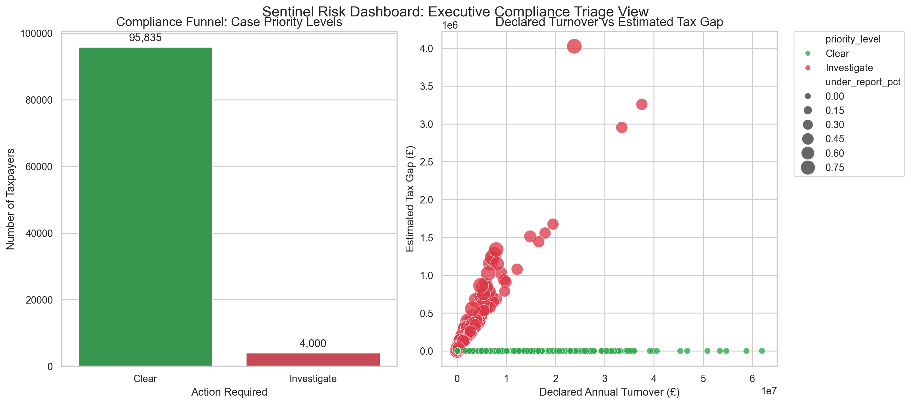

# Sentinel – Tax Risk & Compliance Profiling Engine

> **A proof-of-concept risk scoring system that simulates multi-source taxpayer data feeds, applies composite compliance risk logic, and produces an auditable, tiered priority list for investigation — built to mirror the risk profiling workflows used by HMRC's Risk & Intelligence Service.**

[](https://python.org)
[](https://powerbi.microsoft.com)
[]()

---

## The Business Problem

Tax authorities cannot investigate every taxpayer — they must prioritise. HMRC's compliance analytics teams focus on populations where non-compliance is hardest to detect through normal tax reporting:

- **Self-employed contractors and freelancers** — income not taxed at source
- **Cash-intensive businesses** — restaurants, salons, market traders, takeaways
- **Gig economy workers** — platform income now subject to marketplace reporting
- **Property investors** — rental income and capital gains from second properties

The core question this engine addresses is:

> *Given a synthetic population of taxpayers with varying compliance signals, which entities should be escalated for investigation — and why?*

Sentinel demonstrates how rule-based scoring and composite risk modelling can give compliance teams a clear, at-a-glance view of audit priority and estimated tax exposure.

---

## What Decisions Does This System Support?

| Compliance Question | Where Answered |
|---|---|
| Which taxpayers should be investigated first? | `audit_priority_list.csv` — ranked by risk score |
| What proportion of the population is high/very high risk? | Dashboard — compliance funnel |
| Which sectors have the highest average risk? | `scripts/04_sql_ranking.sql` — industry analysis |
| What is the estimated tax gap for each case? | `risk_scored_taxpayers.csv` — tax gap field |
| Where are the largest anomalies between declared and estimated income? | Dashboard — turnover vs tax gap scatter |

---

## Risk Dashboard



**How to read the dashboard:**

**Left panel — Compliance Funnel:** Shows population split by priority level. Clear = deprioritise. Investigate = escalate. Gives senior leaders an immediate triage view.

**Right panel — Declared Turnover vs Estimated Tax Gap:** X-axis = declared turnover; Y-axis = estimated tax gap; bubble size = under-reporting intensity. Large red bubbles top-right = highest-priority anomalies.

---

## Architecture

```
Business Rules (HMRC published compliance strategy)
              │
              ▼
┌─────────────────────────────┐
│   Synthetic Data Generation │  Python (Faker, Pandas, NumPy)
│   01_generate_synthetic_    │  Privacy-safe taxpayer population
│   data.py                   │  by sector and taxpayer type
└────────────┬────────────────┘
             │
             ▼
┌─────────────────────────────┐
│   Data Validation           │  Custom QA rules:
│   02_data_validation.py     │  - Missing value checks
│                             │  - Logic consistency
│                             │  - Financial integrity
└────────────┬────────────────┘
             │
             ▼
┌─────────────────────────────┐
│   Risk Scoring Engine       │  Composite score (0–100):
│   03_risk_scoring.py        │  - Filing lateness (max 30pts)
│                             │  - Payment lateness (max 30pts)
│                             │  - Under-reporting gap (max 35pts)
│                             │  - Inconsistency penalties (max 25pts)
│                             │  - Escalation bonuses for combined risk
└────────────┬────────────────┘
             │
             ▼
┌─────────────────────────────┐
│   Outputs                   │  audit_priority_list.csv
│                             │  risk_scored_taxpayers.csv
│                             │  validation_report.txt
│                             │  Power BI-compatible export
└────────────┬────────────────┘
             │
             ▼
┌─────────────────────────────┐
│   Stakeholder Dashboard     │  Matplotlib/Seaborn visualisation
│   visualize_risk.py         │  Compliance funnel + tax gap scatter
└─────────────────────────────┘
```

---

## Risk Scoring Model

### Score Components

| Component | Max Points | Rationale |
|---|---|---|
| Filing lateness | 30 | Late filing is a strong predictor of non-compliance |
| Payment lateness | 30 | Payment behaviour indicates cash flow / intent |
| Under-reporting gap | 35 | Core signal — declared vs estimated income divergence |
| Inconsistency penalties | 25 | Cross-source data mismatches (lifestyle vs income) |
| Escalation bonus | Variable | Triggered by severe combined risk patterns |

### Risk Bands

| Score Range | Risk Band | Action |
|---|---|---|
| 0 – 15 | Very Low | No action required |
| 15 – 35 | Low | Routine monitoring |
| 35 – 60 | Medium | Enhanced monitoring |
| 60 – 80 | High | Escalation for review |
| 80 – 100 | Very High | Priority investigation |

---

## Target Populations Modelled

| Population | Why HMRC Scrutinises |
|---|---|
| Self-employed / contractors | Income not taxed at source; under-declaration risk |
| Cash-intensive businesses | Cash transactions harder to trace and verify |
| Gig economy workers | Marketplace reporting now mandatory; gap analysis possible |
| Property investors | Rental income and capital gains frequently under-reported |

---

## Tech Stack

| Layer | Tools |
|---|---|
| Data generation | Python, Faker |
| Data processing | Pandas, NumPy |
| Scoring engine | Custom Python rule engine |
| Data validation | Custom QA assertions |
| Visualisation | Matplotlib, Seaborn |
| Reporting outputs | CSV, Power BI-compatible exports |
| SQL analysis | SQLite-compatible ranking queries |

---

## How to Run

```bash
# Clone and set up
git clone https://github.com/jimimichael/sentinel-tax-risk-engine.git
cd sentinel-tax-risk-engine
pip install -r requirements.txt

# Run the full pipeline
python scripts/01_generate_synthetic_data.py   # Generate taxpayer data
python scripts/02_data_validation.py           # QA and clean
python scripts/03_risk_scoring.py              # Score and band
python visualize_risk.py                       # Generate dashboard image
```

Outputs written to `data/processed/` and `data/outputs/`.

---

## Project Structure

```
sentinel-tax-risk-engine/
├── scripts/
│   ├── 01_generate_synthetic_data.py   # Synthetic taxpayer dataset
│   ├── 02_data_validation.py           # QA checks + cleaned output
│   ├── 03_risk_scoring.py              # Composite scoring + risk bands
│   ├── 04_sql_ranking.sql              # Industry-level ranking query
│   └── 05_power_bi_export.py           # Export for Power BI consumption
├── data/
│   ├── processed/
│   │   ├── cleaned_taxpayers.csv       # Validated dataset
│   │   ├── risk_scored_taxpayers.csv   # Scored + banded output
│   │   └── validation_report.txt       # QA evidence
│   └── outputs/
│       └── audit_priority_list.csv     # Top cases for investigation
├── notebooks/                          # Exploratory analysis
├── powerbi/                            # Power BI-compatible exports
├── visualize_risk.py                   # Stakeholder dashboard script
├── dashboard_output.png                # Dashboard image
├── requirements.txt
└── README.md
```

---

## Relevance to Real-World Applications

The risk scoring patterns demonstrated here are directly applicable to:

- **Tax compliance analytics** (HMRC, international revenue authorities)
- **Credit risk scoring** (lenders, collections strategy, PD modelling)
- **Fraud detection** (financial services, insurance, e-commerce)
- **Regulatory compliance monitoring** (FCA-regulated firms)
- **Sanctions and AML screening** (financial crime analytics)

The core pattern — composite rule-based scoring producing an auditable, tiered priority output — is standard in risk analytics across public and private sector organisations.

---

## HMRC Inspiration & Disclaimer

This project is an **independent educational demonstration** and is not affiliated with HMRC. It is inspired by publicly available sources including:

- HMRC Annual Report & Accounts
- National Audit Office reports on HMRC Connect and compliance analytics
- HMRC compliance strategy publications

All data is entirely synthetic. No real taxpayer data is used or represented.

---

## Skills Demonstrated

`Python` `Pandas` `NumPy` `Faker` `Risk Scoring` `Rule-Based Logic` `Data Validation` `Composite Scoring` `Decision Support` `Compliance Analytics` `Matplotlib` `Seaborn` `Power BI` `SQL`

---

*Part of a portfolio demonstrating applied data analytics and decision-support systems. See also: [APHA Animal Health Dashboard](https://github.com/jimimichael/APHA-Animal-Health-Welfare-Outbreak-Dashboard) | [UK Financial Complaints Pipeline](https://github.com/jimimichael/uk-financial-complaints-pipeline) | [DE ZoomCamp 2026](https://github.com/jimimichael/DE_ZoomCamp_2026)*
